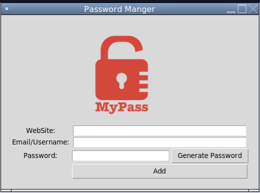
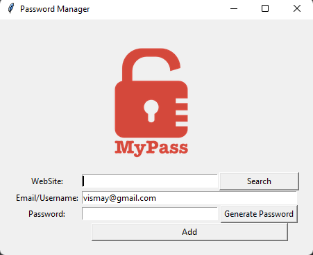

# Python-Password_Manager
Manage your all password in one file through this python program, which provide you GUI support and save your all password, email id and website info.
YOU NEEDED TO REMEMBER YOUR PASSWORD OR DONT NEED TO SAVE IN THIRD PARTY APPLICATION ON THIER SERVER.(Cyber threat 💀💀😵😵) SAVE IN YOUR SAFE AND LOCAL SYSTEM.

## Setup
before you run main.py please install required python and it library 'pyperclip' so there will no error.
Make sure you download all files in one folder which availbles.

## Run
run main.py file as per your confirt by python and pop will come up as show.

You can also Generate password and automatically copy in your click and you have to just copy and paste where you want.

## NEW UPDATES

Updates: 1. Search button setupt to find user's email and password for that specific website
         2. File format updated to json from txt.
         3. download only two file to run your program. mai.py and logo.png in one file.
-->you can generate password as per standard password policy for each sites.
         
Reach out me if there is any bug in my github account : https://github.com/Visu98

Thank you!

ENJOY and save your password in password manager😁😊
